# AI Threat Detection & Security Operations

<div align="center">


**A threat detection system analyzing logs and emails to detect anomalies and classify threats using advanced AI, including phishing and QRishing detection.**

[Features](#features) • [Quick Start](#quick-start) • [API Documentation](#core-endpoints) • [Architecture](#architecture) • [Testing](#testing)

</div>

---

## 📋 Abstract

A comprehensive system designed to analyze logs and emails, detect anomalies, and classify threats using AI-powered intelligence. The platform integrates multiple threat intelligence sources and machine learning models to identify phishing attacks, malicious URLs, QRishing attempts, and suspicious log activities in real-time.

> **📚 Quick Links**: [Documentation Index](docs/) | [Testing Guide](backend/tests/README.md) | [API Reference](docs/01-API-Reference.md) | [System Architecture](docs/02-System-Architecture.md) | [Setup Guide](docs/03-Setup-Installation.md)

## ✨ Key Features

### 🔗 URL Intelligence & Threat Detection
- **Unified Pipeline**: Multi-layered threat intelligence combining VirusTotal, Google Safe Browsing, PhishTank, AbuseIPDB, and RDAP
- **AI Fusion Scoring**: Google Gemini API integration for advanced threat analysis and contextual reasoning
- **URL Caching**: Optimized cache system for rapid repeated lookups
- **Real-time Verification**: Instant URL status checks with detailed threat classifications

### 📧 Email Security Analysis
- **Gmail Integration**: Automatic email fetching and analysis from Gmail accounts
- **Phishing Detection**: NLP-based classification with URL verification pipeline
- **Smart Alerts**: Automated alerts via Brevo email service
- **Dashboard Logging**: Complete audit trail with searchable logs

### 🔲 QR Code & QRishing Detection
- **QR Decode & Analysis**: Automatic QR image decoding with VirusTotal submission
- **QRishing Protection**: Detect malicious QR codes leading to phishing sites
- **Malware Detection**: Alert generation for detected threats

### 📊 SOC & Log Analysis
- **Rule-based Analysis**: Pattern matching for suspicious log activities
- **AI-powered Insights**: Gemini API analysis for complex security events
- **JSON Structured Output**: Machine-readable threat summaries
- **Automated Classification**: Security event categorization and severity scoring

### 🎨 Real-time Dashboard & Monitoring
- **Live Threat Cards**: Real-time threat status visualization
- **SocketIO Updates**: Live socket connections for instant notifications
- **Advanced Logging**: Comprehensive activity logs with CSV export
- **Settings Management**: Configurable security parameters and API keys

### 🔌 Browser Extension Integration
- **Tab Activity Monitoring**: Capture and log risky browsing events
- **Extension Webhook**: Submit suspicious URLs from the browser
- **Seamless Integration**: Chrome extension included for user-level protection

---

## 🚀 Quick Start

### Prerequisites
- Python 3.11 or higher
- pip package manager
- Valid API keys for: VirusTotal, Google Safe Browsing, Gemini, Brevo
- Gmail OAuth credentials (optional, for email scanning)

### Installation

1. **Clone the repository and navigate to backend:**
   ```bash
   cd backend
   ```

2. **Create and activate virtual environment:**
   ```bash
   python -m venv .venv
   .venv\Scripts\activate  # Windows
   # source .venv/bin/activate  # macOS/Linux
   ```

3. **Install dependencies:**
   ```bash
   pip install -r requirements.txt
   ```

4. **Configure environment variables:**
   ```bash
   # Copy example configuration
   cp .env.example .env
   
   # Edit .env and add your API keys
   # Required: VIRUSTOTAL_API_KEY, SAFEBROWSING_API_KEY, GEMINI_API_KEY, BREVO_API_KEY
   ```

5. **Setup Gmail credentials (optional):**
   ```bash
   # Place your Gmail OAuth credentials at:
   # backend/credentials/credentials.json
   # Token will be auto-generated on first run
   ```

6. **Initialize database and start server:**
   ```bash
   python app.py
   ```

7. **Access the dashboard:**
   ```
   Open http://localhost:5000/dashboard in your browser
   ```

---

## 📡 Core API Endpoints

| Method | Endpoint | Description | Payload |
|--------|----------|-------------|---------|
| **POST** | `/check-url` | Unified URL threat check | `{ "url": "https://...", "force_refresh": false }` |
| **POST** | `/api/threat_lookup` | Lightweight URL lookup | `{ "url": "https://..." }` |
| **POST** | `/email_scanner/api/scan` | Trigger Gmail scan & analysis | `{ "count": 10 }` |
| **POST** | `/api/scan-qr` | Scan QR code image | Multipart form: `qr_image` |
| **POST** | `/api/tab-activity` | Log browser tab activity | `{ "url": "https://..." }` |
| **GET** | `/api/logs` | Retrieve threat logs | Query: `?limit=50&offset=0` |
| **GET** | `/api/soc-analyzer` | SOC analysis interface | N/A |

---

## 🏗️ System Architecture

```mermaid
graph TB
    subgraph "User Interfaces"
        Dashboard["🎨 Web Dashboard<br/>Port 5000"]
        Extension["🔌 Browser Extension<br/>Chrome/Manifest V3"]
        API["📡 REST API<br/>JSON Endpoints"]
    end

    subgraph "Flask Application Layer"
        Router["Flask Router<br/>& Middleware"]
        SocketIO["WebSocket Manager<br/>SocketIO"]
        Auth["Authentication<br/>Session Handler"]
    end

    subgraph "Processing Engines"
        URLScanner["🔗 URL Scanner<br/>threat_checker.py"]
        EmailScanner["📧 Email Scanner<br/>email_scanner.py"]
        QRScanner["🔲 QR Scanner<br/>QRishing Detection"]
        SOCAnalyzer["📊 SOC Log Analyzer<br/>soc_analyzer.py"]
    end

    subgraph "Threat Intelligence Pipeline"
        VT["VirusTotal API<br/>Malware & URLs"]
        GSB["Google Safe<br/>Browsing API"]
        PhishTank["PhishTank API<br/>Phishing DB"]
        AbuseIPDB["AbuseIPDB API<br/>IP Reputation"]
        RDAP["RDAP Whois<br/>Domain/IP Info"]
    end

    subgraph "AI & Analysis"
        Gemini["🤖 Google Gemini API<br/>Fusion Scoring<br/>& AI Analysis"]
        RiskScoring["Risk Calculation<br/>Engine"]
    end

    subgraph "Data & Persistence"
        SQLiteDB["💾 SQLite Database<br/>Threat Logs & Alerts"]
        URLCache["⚡ URL Cache<br/>Performance Layer"]
        AlertQueue["📢 Alert Queue<br/>Email Dispatch"]
    end

    subgraph "External Services"
        Gmail["Gmail API<br/>Email Retrieval"]
        Brevo["Brevo Email<br/>Alert Service"]
    end

    subgraph "Outputs & Notifications"
        Dashboard_Output["Real-time Alerts<br/>CSV Export"]
        UserNotification["📧 Email Notifications<br/>to Users"]
    end

    %% User Interfaces to Flask
    Dashboard -->|HTTP/WebSocket| Router
    Extension -->|POST/HTTP| Router
    API -->|HTTP Requests| Router

    %% Flask Layer
    Router -->|Route| SocketIO
    Router -->|Verify| Auth
    SocketIO -->|Live Updates| Dashboard

    %% Routing to Engines
    Router -->|URL Input| URLScanner
    Router -->|Email Trigger| EmailScanner
    Router -->|QR Image| QRScanner
    Router -->|Log Data| SOCAnalyzer

    %% Processing to Threat Intel
    URLScanner -->|Check URL| VT
    URLScanner -->|Check URL| GSB
    URLScanner -->|Check URL| PhishTank
    EmailScanner -->|Extract URLs| VT
    EmailScanner -->|Extract URLs| GSB
    QRScanner -->|Decode & Verify| VT
    SOCAnalyzer -->|IP/Domain Lookup| AbuseIPDB
    SOCAnalyzer -->|IP/Domain Lookup| RDAP

    %% Threat Intel to AI
    VT -->|Results| Gemini
    GSB -->|Results| Gemini
    PhishTank -->|Results| Gemini
    AbuseIPDB -->|Results| Gemini
    RDAP -->|Results| Gemini

    %% AI to Scoring
    Gemini -->|Analysis| RiskScoring
    RiskScoring -->|Score| SQLiteDB

    %% Caching
    URLScanner -->|Cache Hit/Miss| URLCache
    URLCache -->|Cached Data| Gemini

    %% Database & Alerts
    URLScanner -->|Log| SQLiteDB
    EmailScanner -->|Log| SQLiteDB
    QRScanner -->|Log| SQLiteDB
    SOCAnalyzer -->|Log| SQLiteDB

    %% External Services
    EmailScanner -->|Fetch Emails| Gmail
    AlertQueue -->|Send Alerts| Brevo

    %% Output
    SQLiteDB -->|Retrieve Logs| Dashboard_Output
    AlertQueue -->|Trigger| UserNotification
    RiskScoring -->|Update| Dashboard_Output

    %% Styling
    classDef userInterface fill:#4A90E2,stroke:#2E5C8A,color:#fff,stroke-width:2px
    classDef flaskLayer fill:#FF6B6B,stroke:#CC5555,color:#fff,stroke-width:2px
    classDef processing fill:#4ECDC4,stroke:#2BA39E,color:#fff,stroke-width:2px
    classDef threatIntel fill:#FFE66D,stroke:#CCB954,color:#333,stroke-width:2px
    classDef ai fill:#95E1D3,stroke:#6FB8A8,color:#333,stroke-width:2px
    classDef storage fill:#F38181,stroke:#C26B6B,color:#fff,stroke-width:2px
    classDef external fill:#AA96DA,stroke:#8770B8,color:#fff,stroke-width:2px
    classDef output fill:#FCBAD3,stroke:#CA959B,color:#333,stroke-width:2px

    class Dashboard,Extension,API userInterface
    class Router,SocketIO,Auth flaskLayer
    class URLScanner,EmailScanner,QRScanner,SOCAnalyzer processing
    class VT,GSB,PhishTank,AbuseIPDB,RDAP threatIntel
    class Gemini,RiskScoring ai
    class SQLiteDB,URLCache,AlertQueue storage
    class Gmail,Brevo external
    class Dashboard_Output,UserNotification output
```



See [System Architecture](docs/02-System-Architecture.md) for detailed flow diagrams.

---

## 📚 Documentation

- **[API Reference](docs/01-API-Reference.md)** — Complete endpoint documentation and request/response schemas
- **[System Architecture](docs/02-System-Architecture.md)** — Detailed system design and component interactions
- **[Setup & Installation](docs/03-Setup-Installation.md)** — Deployment and configuration guide
- **[Security Features](docs/04-Security-Features.md)** — Security implementation details
- **[Testing Guide](docs/05-Testing-Guide.md)** — Unit, integration, and E2E testing
- **[Contributing](docs/06-Contributing.md)** — Development guidelines

---

## 🧪 Testing

### Run All Tests
```bash
cd backend
pytest
```

### Run Specific Test Suite
```bash
# Unit tests
pytest tests/unit/

# Integration tests
pytest tests/integration/

# End-to-end tests
pytest tests/e2e/

# Debug tests
pytest tests/debug/
```

### Test Coverage
```bash
pytest --cov=backend --cov-report=html
```

### Continuous Integration
This project uses GitHub Actions to automatically run the full test suite on every push and pull request. See `.github/workflows/ci.yml` for the pipeline configuration.

> **Note**: External API calls are mocked or rate-limited during testing to ensure reliability and reproducibility.

See [Testing Guide](backend/tests/README.md) for detailed testing procedures.

---

## 📁 Project Structure

```
├── backend/                          # Flask application & core logic
│   ├── services/                     # Threat intelligence integrations
│   │   ├── virustotal_service.py
│   │   ├── gemini_service.py
│   │   ├── gmail_service.py
│   │   └── ...
│   ├── email_scanner.py              # Email analysis pipeline
│   ├── threat_checker.py             # URL threat verification
│   ├── soc_analyzer.py               # Log analysis engine
│   ├── models.py                     # Database models
│   ├── app.py                        # Flask application entry point
│   └── tests/                        # Comprehensive test suite
├── dashboard/                        # Web UI & frontend
│   ├── templates/                    # HTML templates
│   └── static/                       # CSS, JavaScript, images
├── SuspiciousURLDetector/            # Browser extension
│   ├── manifest.json
│   ├── background.js
│   └── popup.html
├── docs/                             # Documentation
└── README.md                         # This file
```

---

## 🔐 Security Considerations

- **Environment Variables**: All API keys stored in `.env` (never committed)
- **Database Security**: SQLite with query parameterization to prevent SQL injection
- **Authentication**: Settings page requires password verification
- **SSL/TLS**: Support for HTTPS in production deployment
- **Rate Limiting**: API endpoint protection against abuse

See [Security Features](docs/04-Security-Features.md) for comprehensive security documentation.

---

## 🎯 Use Cases

### 1. Security Operations Center (SOC)
- Monitor logs for suspicious activities
- Analyze security events with AI assistance
- Generate structured threat reports

### 2. Email Security Gateway
- Scan incoming emails for phishing
- Verify URLs in email bodies
- Alert on malicious content

### 3. Browser-based Protection
- Real-time URL verification while browsing
- QR code scanning and verification
- Threat intelligence at the point of access

### 4. Incident Response
- Quick URL/IP reputation checks
- Historical log analysis
- Automated threat classification

---

## 🛠️ Tech Stack

**Backend:**
- Python 3.11+
- Flask 3.0+ (Web framework)
- SQLAlchemy (ORM)
- SQLite (Database)
- Flask-SocketIO (Real-time updates)

**AI & Intelligence:**
- Google Gemini API (AI analysis)
- VirusTotal API (Malware detection)
- Google Safe Browsing API (URL safety)
- PhishTank API (Phishing database)
- AbuseIPDB API (IP reputation)
- RDAP (Domain/IP whois)

**Frontend:**
- HTML5 / CSS3
- JavaScript / Bootstrap
- Chart.js (Data visualization)
- Socket.io-client (Real-time updates)

**Browser Extension:**
- Manifest V3
- Chrome API

---

## 📊 Demo Scenario (10 minutes)

1. **Dashboard Overview** — Show live threat statistics and recent detections
2. **URL Scanning** — Submit a known phishing test URL and display threat verdict with AI reasoning
3. **Email Analysis** — Trigger email scanning and show phishing classification results
4. **QR Code Detection** — Upload a test QR code and display scan results
5. **SOC Log Analysis** — Paste a log snippet with suspicious activities and display JSON summary

---

## 🔄 Workflow Example

```
User Input (URL/Email/QR)
    ↓
Parser & Validator
    ↓
Threat Intelligence Check (VT, GSB, PhishTank, RDAP, AbuseIPDB)
    ↓
AI Fusion Analysis (Gemini API)
    ↓
Risk Score Calculation
    ↓
Database Logging
    ↓
Dashboard Update & Alert Generation
    ↓
User Notification
```

---

## 📝 Configuration

### Environment Variables (.env)
```env
# API Keys
VIRUSTOTAL_API_KEY=your_vt_key
SAFEBROWSING_API_KEY=your_gsb_key
GEMINI_API_KEY=your_gemini_key
PHISHTANK_API_KEY=your_phishtank_key
ABUSEIPDB_API_KEY=your_abuseipdb_key
BREVO_API_KEY=your_brevo_key

# Gmail (Optional)
GMAIL_SENDER_EMAIL=your_email@gmail.com

# Server
FLASK_ENV=development
SECRET_KEY=your_secret_key
```

---

## 📜 License

This project is licensed under the MIT License — see [LICENSE](LICENSE) file for details.

---

## 👤 Author

**Sabarish R**

📧 sabarish.edu2024@gmail.com  
🔗 [LinkedIn Profile](https://www.linkedin.com/in/sabarishr08)

> **Note**: External API calls are mocked or rate-limited during testing to ensure reliability and reproducibility.

---

## 📧 Support & Contact

For questions, issues, or feature requests, please open an issue on GitHub.

---

<div align="center">

**[⬆ back to top](#ai-threat-detection--security-operations)**

</div>
