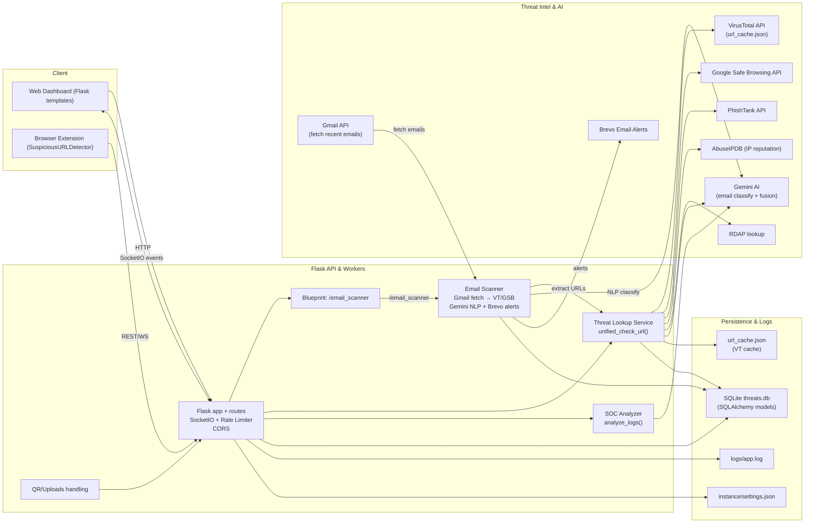

# Architecture Diagram

```mermaid
flowchart LR
  subgraph Client
    Browser["Web Dashboard (Flask templates)"]
    Extension["Browser Extension (SuspiciousURLDetector)"]
  end

  subgraph Backend["Flask API & Workers"]
    App["Flask app + routes\nSocketIO + Rate Limiter\nCORS"]
    EmailBP["Blueprint: /email_scanner"]
    EmailScan["Email Scanner\nGmail fetch → VT/GSB\nGemini NLP + Brevo alerts"]
    ThreatPipeline["Threat Lookup Service\nunified_check_url()"]
    SOC["SOC Analyzer\nanalyze_logs()"]
    QR["QR/Uploads handling"]
  end

  subgraph Services["Threat Intel & AI"]
    VT["VirusTotal API\n(url_cache.json)"]
    GSB["Google Safe Browsing API"]
    PT["PhishTank API"]
    Abuse["AbuseIPDB (IP reputation)"]
    RDAP["RDAP lookup"]
    Gemini["Gemini AI\n(email classify + fusion)"]
    Brevo["Brevo Email Alerts"]
    Gmail["Gmail API\n(fetch recent emails)"]
  end

  subgraph Data["Persistence & Logs"]
    DB["SQLite threats.db\n(SQLAlchemy models)"]
    Cache["url_cache.json\n(VT cache)"]
    Settings["instance/settings.json"]
    Logs["logs/app.log"]
  end

  Browser -->|HTTP| App
  Extension -->|REST/WS| App
  App <--> |SocketIO events| Browser

  App --> EmailBP
  EmailBP -->|/email_scanner| EmailScan
  EmailScan -->|extract URLs| ThreatPipeline
  EmailScan -->|NLP classify| Gemini
  EmailScan -->|alerts| Brevo
  Gmail -->|fetch emails| EmailScan

  App --> ThreatPipeline
  ThreatPipeline --> VT
  ThreatPipeline --> GSB
  ThreatPipeline --> PT
  ThreatPipeline --> Abuse
  ThreatPipeline --> RDAP
  ThreatPipeline --> Gemini
  ThreatPipeline --> Cache

  App --> SOC
  SOC --> Gemini

  App --> DB
  ThreatPipeline --> DB
  EmailScan --> DB
  App --> Logs
  App --> Settings
  QR --> App
```
